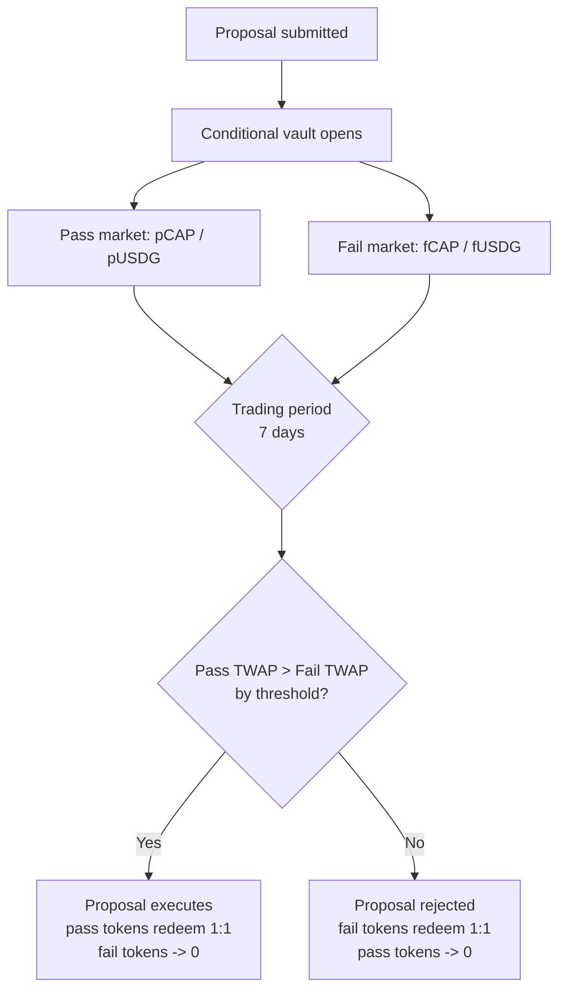

# How It Works

> **Status: pre-launch draft.** Parameters marked *initial* are proposals and
> will change. Nothing here is deployed.

This is the mechanism, end to end. If you only read one technical page, read
this one.

## The question every proposal asks

A proposal on Capital DAO is not put to a vote. It's put to two markets, which
together answer one question:

> **Is this company worth more if we do this, or if we don't?**

To answer it, we need both prices at the same time — the value of the company
*with* the proposal and *without* it. Only one of those worlds will actually
happen. So we build markets in both, let people trade, and then make the world
that the market priced higher.

## Conditional tokens

The trick that makes this possible is the **conditional token**: a token that
only becomes real if a specific outcome occurs.

When a proposal opens, anyone can deposit into a **conditional vault** and
receive two tokens back:

```
deposit  100 CAP   ->  100 pCAP  (worth 1 CAP if the proposal PASSES, else 0)
                   +   100 fCAP  (worth 1 CAP if the proposal FAILS,  else 0)

deposit  1000 USDG ->  1000 pUSDG (worth 1 USDG if it PASSES, else 0)
                   +   1000 fUSDG (worth 1 USDG if it FAILS,  else 0)
```

You always get the full amount of *both*. Nothing is lost by splitting — you're
converting one certain claim into two conditional ones, exactly one of which
will survive. You can recombine one of each back into the underlying at any
time, and after resolution the winning side redeems 1:1 while the losing side is
worthless.

This is the same primitive Gnosis's Conditional Tokens Framework pioneered,
narrowed to the binary pass/fail case we actually need.

## Two markets, side by side

Those conditional tokens trade in two separate pools:

| Market | Pair | Prices the world where… |
| --- | --- | --- |
| **Pass** | pCAP / pUSDG | the proposal is executed |
| **Fail** | fCAP / fUSDG | the proposal is rejected |

Both run simultaneously, for the whole trading period. The pass market's price
is the company's value *conditional on* the proposal passing; the fail market's
is its value *conditional on* the proposal failing.

Because both markets run at the same time, anything that moves the token for
unrelated reasons — a market-wide crash, a sector rally, a bitcoin move — hits
both equally and cancels out of the comparison. What's left is the market's
estimate of the proposal's own effect. This is why futarchy compares two
concurrent conditional markets rather than measuring price before and after a
decision.



## A worked example

A company called Capital Widgets has an ownership coin, **CAP**, trading around
$1.10. Its treasury holds 2,000,000 USDG.

**The proposal:** spend 500,000 USDG to acquire a small competitor.

**Day 0.** The proposal is submitted with its executable transaction attached.
The vault opens; the pass and fail markets are seeded with liquidity. Both start
near $1.10, since the market hasn't formed a view yet.

**Days 1–7.** Traders take positions.

- A trader who thinks the acquisition is a bargain buys pCAP. If the deal
  happens and CAP rises, their pCAP redeems for real CAP at the higher price. If
  the proposal is rejected, their pCAP is worth nothing.
- A trader who thinks the team is overpaying buys fCAP, and profits if the
  proposal is rejected and the company retains its cash.
- Someone with genuine private information — say, that the competitor is losing
  its largest customer — has an unusually strong incentive to act on it, because
  they can size a position rather than cast a vote.

Prices separate as the market forms a view:

| | Pass market (pCAP) | Fail market (fCAP) |
| --- | --- | --- |
| Day 1 | $1.11 | $1.10 |
| Day 3 | $1.19 | $1.11 |
| Day 7 | $1.26 | $1.09 |
| **7-day TWAP** | **$1.24** | **$1.10** |

**Day 7, settlement.** The rule is mechanical:

```
pass TWAP  >=  fail TWAP  x  (1 + threshold)
   $1.24   >=    $1.10    x        1.02
   $1.24   >=    $1.122          -> TRUE
```

The proposal executes. The acquisition transaction fires from the treasury
automatically — no signature, no admin, no discretion. pCAP and pUSDG become
redeemable 1:1 for CAP and USDG. fCAP and fUSDG go to zero.

The market said the company is worth about 13% more with the deal than without
it. The deal happened. Nobody voted.

## The rules that make it hold up

The mechanism above is simple. Making it robust against people actively trying
to break it is where the real design lives.

### Time-weighted prices, not spot

Settlement uses a **TWAP** (time-weighted average price) over the full trading
period, never the price at a single moment. A spot price at the closing instant
could be pushed by anyone with enough capital for one block. To move a 7-day
TWAP you must hold the price away from fair value for *days*, against everyone
willing to take free money off you the whole time.

### Capped price movement per observation

The TWAP oracle limits how far the recorded price can move between observations.
An attacker who slams the price in a single transaction doesn't get that price
into the average — the oracle records only the capped move. This converts
manipulation from a one-block capital problem into a sustained, bleeding one.

### A threshold, not a tie-break

The pass market must beat the fail market by a margin (*initial: 2%*), not
merely edge it. Proposals whose benefit is inside the noise get rejected. The
default is "don't."

### Liquidity requirements

A market that nobody trades in prices nothing. Every proposal requires minimum
seeded liquidity in both markets before it can settle (*initial: TBD, set per
launch*). Below that, the proposal fails by default rather than settling on a
thin, manipulable price.

### Both markets are real markets

Notably, the fail market must be as liquid and as tradeable as the pass market.
A common mistake is treating the fail side as a formality — but the comparison
is only meaningful if both prices are trustworthy.

## Initial parameters

Every one of these is a starting point, adjustable per launch and by governance.

| Parameter | Initial value | What it trades off |
| --- | --- | --- |
| Trading period | 7 days | Manipulation resistance vs. decision speed |
| Pass threshold | 2% | Avoiding noise-driven passes vs. blocking marginal gains |
| TWAP window | Full trading period | Robustness vs. responsiveness |
| Max observation change | TBD | Manipulation cost vs. legitimate price discovery |
| Minimum liquidity | TBD | Price reliability vs. accessibility for small launches |
| Quote asset | USDG | Liquidity vs. neutrality — see note below |
| Proposal bond | TBD | Spam resistance vs. open participation |

**A note on USDG.** USDG is native to Robinhood Chain and is where stablecoin
liquidity concentrates there, which makes it the practical quote asset. It is
worth stating plainly that this introduces a dependency on a specific stablecoin
issuer. See [Risks](12-risks.md).

## What happens to your money

A question worth answering directly, since conditional tokens confuse people:

- **If you do nothing**, holding plain CAP through a proposal, nothing happens
  to you. Your tokens are untouched, whatever the outcome.
- **If you split into conditional tokens and don't trade**, you can recombine or
  redeem for exactly what you put in. Splitting is not a bet.
- **You only take a position by trading** — selling one side and keeping the
  other. That's the point at which you can win or lose.

## Next

- What the underlying token represents: [Ownership Coins](04-ownership-coins.md)
- Why the treasury can't be drained: [The Treasury](06-treasury.md)
- Trading these markets in practice: [For Traders](08-for-traders.md)
- Contract-level detail: [Architecture](10-architecture.md)
