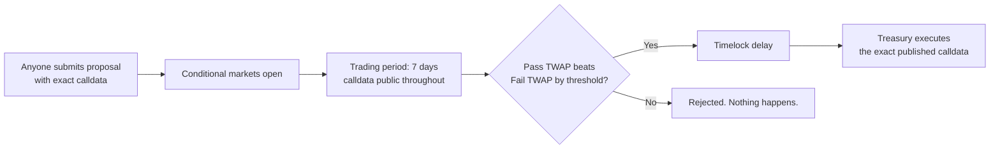

# The Treasury

> **Status: pre-launch draft.** Contracts described here are built but not audited,
> or deployed.

## The claim

When a company raises on Hoodarchy, the money goes into a treasury contract
that **the founders cannot withdraw from**.

Not "shouldn't." Not "have promised not to." The contract exposes no function
that lets them. There is no owner, no admin, no emergency multisig, no upgrade
path that adds one later. The only way value leaves the treasury is a proposal
that passed its market.

This is the load-bearing claim of the entire product. Everything else — the
markets, the ownership coin, the milestones — is downstream of whether the money
is actually safe.

## Why "unruggable" is the right word

The word gets thrown around loosely, so here's what it means concretely.

A rug requires a path from the treasury to an address the team controls, without
the consent of holders. The usual paths:

| Attack | How it normally works | Why it doesn't work here |
| --- | --- | --- |
| **Direct withdrawal** | An `onlyOwner` withdraw function | No such function exists |
| **Multisig collusion** | Signers agree to move funds | No multisig has spending authority |
| **Malicious upgrade** | Proxy upgraded to add a drain | Treasury is non-upgradeable; upgrades of any kind require a passed proposal |
| **Governance capture** | Buy/borrow enough tokens to win a vote | There is no vote to win. You'd have to hold a *price* away from fair value for days while arbitrageurs take the other side |
| **Sneaky proposal** | Bury a drain in a complex proposal | The exact calldata is published for the full trading period, and anyone who spots it profits by shorting the pass market |
| **Infinite mint** | Mint tokens, dump on holders | Mint authority is fixed at deploy; changing it is a proposal |

The last two are worth dwelling on, because they're where a determined attacker
would actually go.

**A malicious proposal is a market's easiest case.** If a proposal transfers the
treasury to the founder's wallet, the pass market prices a company with no
assets — near zero — and the fail market prices a company that still has its
money. The comparison isn't close, the proposal is rejected, and everyone who
noticed made money doing it. Futarchy is *most* reliable exactly where the harm
is largest and most obvious.

**Capturing the market is not like capturing a vote.** In a token vote, buying
influence is a fixed cost: acquire tokens, vote, done. In a futarchy, you must
push the pass market above the fail market and hold it there for the full
trading period, while every other participant sells into your bid and takes your
money. The cost isn't fixed — it scales with how wrong you are and how long you
persist. And the more valuable the treasury you're trying to steal, the more
capital defends it, because the profit from opposing you grows with the size of
the mispricing.

## How money actually leaves

Four properties of this flow matter:

**Proposals carry executable calldata, not prose.** A proposal isn't a
description of intent that someone implements afterwards. It *is* the
transaction. What the market prices and what executes are byte-identical.

**Execution is automatic and permissionless.** Once a proposal passes, anyone can
trigger execution. No signature is required and no one can decline to execute a
result they dislike.

**A passed proposal cannot be altered.** Nobody edits the calldata between
settlement and execution.

**A timelock sits between passing and executing** (*initial: 24–48 hours,
TBD*). This is a deliberate belt-and-braces measure: if something has gone
badly wrong — a bug in settlement, an oracle failure — it gives humans a window
to react. It's an admission that the mechanism might fail, which is the right
posture for code holding other people's money.

## Where treasury assets sit

Treasuries hold **USDG** by default, the native stablecoin on Robinhood Chain.

> ⚠️ **USDG has 6 decimals, not 18.** Noted here because it's a recurring source
> of catastrophic accounting bugs, and anyone auditing or integrating with these
> contracts should have it front of mind.

Idle capital could earn yield rather than sitting still, and that's worth doing —
but it's a real risk surface, not free money. Any yield strategy would be
adopted the same way as anything else: a proposal, priced by the market, with
the specific protocol and parameters in the calldata. No yield deployment
happens by default or at anyone's discretion.

## The honest limitations

The guarantees above are only as good as the code and the assumptions
underneath. Specifically:

- **Smart contract risk is real.** An unruggable treasury with a bug in it is
  still drainable. Audits reduce this; they don't eliminate it. See
  [Security](11-security.md).
- **Illiquid markets price badly.** Every protection here assumes the markets are
  liquid enough that mispricings get arbitraged. A market nobody trades in
  provides no defence, which is why minimum liquidity requirements exist and why
  small launches carry more governance risk than large ones.
- **The market can simply be wrong.** Futarchy produces the market's best
  estimate, and best estimates are sometimes bad. It protects against theft far
  better than against error.
- **Legitimate spending is slow.** A company that needs to move fast will find
  this frustrating. That's the cost of the guarantee, and it's a genuine cost.
- **The stablecoin is a dependency.** If USDG were to depeg or be frozen, a
  contract-level guarantee about USDG balances doesn't help. See
  [Risks](12-risks.md).

## Next

- [How It Works](03-how-it-works.md) — the settlement mechanism in detail
- [Security](11-security.md) — audits, keys, disclosure
- [Risks and Disclosures](12-risks.md)
