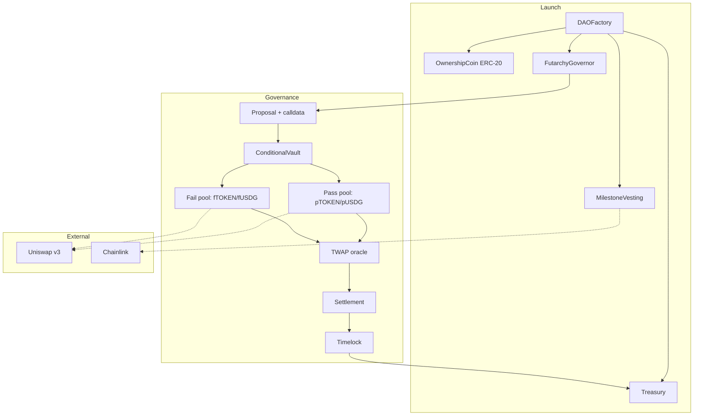

# Architecture

> **Status: partly built.** This page still describes some intended design, but
> the core is now written and deployed: conditional vault, lagged-price oracle,
> conditional AMM, Governor and Executor. Where this page and the decision log
> disagree, **[DECISIONS.md](../DECISIONS.md) is authoritative** — several
> "open questions" below have since been answered by building. Unaudited.

Audience: engineers, auditors, and anyone doing technical diligence.

## System overview



## Contract responsibilities

| Contract | Responsibility | Notes |
| --- | --- | --- |
| `DAOFactory` | Atomically deploys a full company: token, treasury, governor, vesting | Deterministic addresses via CREATE2; must be atomic so no window exists where a treasury has no governor |
| `OwnershipCoin` | ERC-20 with fixed supply and no hidden mint authority | Minimal by design. Every extra feature is attack surface |
| `ConditionalVault` | Splits/merges underlying into pass and fail tokens; handles redemption | The core primitive. See below |
| `ConditionalToken` | ERC-20 representing a conditional claim | One per (vault, outcome) |
| `FutarchyGovernor` | Proposal lifecycle: create, open markets, settle, execute | The state machine |
| `MarketFactory` | Creates the paired pass/fail pools and seeds liquidity | Wraps Uniswap v3 |
| `TwapOracle` | Manipulation-resistant time-weighted prices with capped per-observation movement | Security-critical |
| `Treasury` | Holds assets; executes only on the governor's instruction | No owner, no withdraw, non-upgradeable |
| `Timelock` | Delay between settlement and execution | Last line of defence |
| `MilestoneVesting` | Releases team allocation against verified milestones | See [Pay for Performance](07-pay-for-performance.md) |

## Key design decisions

### Purpose-built conditional vaults, not a Gnosis CTF fork

The obvious starting point is Gnosis's Conditional Tokens Framework, which
pioneered this primitive. **We checked, and forking it directly is the wrong
call.**

Two reasons:

**It's Solidity 0.5.** `ConditionalTokens.sol` declares `pragma solidity ^0.5.1`
and depends on `openzeppelin-solidity@2.3.0` (verified 2026-07-26). It cannot
compile alongside 0.8.x contracts. Using it means either running two compiler
versions in one build and interoperating across the boundary, or a full port —
and a port of a general-purpose framework is not a small, low-risk piece of
work.

**It's built for a much harder problem than ours.** CTF supports arbitrary
outcome partitions, nested conditions, and ERC-1155 position IDs derived from
collection hashes. Hoodarchy needs exactly one shape: *binary, pass/fail, one
underlying, redeem 1:1*. That's a few hundred lines of auditable 0.8 code with
ERC-20 conditional tokens, which compose with Uniswap v3 directly and are far
easier for wallets, indexers, and auditors to reason about than ERC-1155
positions.

We take the *idea* from CTF and MetaDAO. We don't take the 0.5 code.

**Open question:** ERC-20 conditional tokens compose better and are simpler, but
mean deploying two token contracts per proposal. At high proposal volume, ERC-1155
would be cheaper. Given gas is ~0.05 gwei here, simplicity wins for now, but this
should be re-examined if volume grows.

### The AMM sits behind an interface, so the version is not load-bearing

Uniswap **v2, v3 and v4 are all deployed** on Robinhood Chain. v4 lives at a
chain-specific address rather than the canonical one it uses elsewhere, which is
why an earlier draft of these docs wrongly recorded it as absent.

The oracle does not read a pool directly. It reads an `IPriceSource`, and a
per-version adapter implements that. This keeps the part that carries the
security — the rate limiting and time weighting — independent of which AMM is
underneath, so the pool choice can be made on merit and revisited without
re-auditing the core.

v4 hooks are a genuinely better fit for the long run: conditional-pool logic
could live in a hook that updates the oracle on every trade, rather than in
wrapper contracts waiting to be poked. Which version the pass/fail pools
actually use is still open — see D15 in the decision log.

### The TWAP oracle is the most security-critical component

Everything else can be conservative and boring. The oracle is where an attacker
will focus, because corrupting the price corrupts the decision.

Requirements:

- Time-weighted over the full trading period, never spot
- **Capped movement per observation**, so a single-block push can't enter the
  average
- Manipulation cost that scales with the treasury being defended
- Graceful failure: if the oracle can't produce a trustworthy price, the
  proposal must **fail**, never pass

**Open question:** use Uniswap v3's built-in pool observations, or maintain our
own oracle? v3's oracle is battle-tested but its manipulation resistance depends
on pool liquidity, which will be thin in new conditional pools. A custom oracle
with an explicit movement cap gives more control and is more code to get wrong.
This needs a written design and an adversarial review before implementation.

### USDG's 6 decimals

Stated in three places because it will otherwise cause a real incident: **USDG
has 6 decimals.** The ownership coin will have 18. Every price, quote, and
treasury calculation crossing that boundary must scale explicitly.

Mitigations in the environment already: `RobinhoodChain.USDG_DECIMALS`, explicit
`usdg()` / `tokens()` helpers in the test base, and a fork test asserting the
value on mainnet so a change breaks the build.

## Failure modes and intended responses

| Failure | Response |
| --- | --- |
| Oracle can't produce a trustworthy price | Proposal fails. Never pass on bad data |
| Liquidity below minimum at settlement | Proposal fails |
| Both markets priced identically | Proposal fails (threshold not met) |
| Sequencer downtime during trading | Extend the trading period — **open question:** the extension mechanism must not itself be manipulable |
| Malicious proposal calldata | Market prices it near zero and rejects it; timelock as backstop |
| Bug found in a live proposal | Timelock window; **open question:** is there a pause authority, and if so, who holds it? See [Security](11-security.md) |

## Open questions

Genuinely undecided. Listed so nobody mistakes silence for a decision.

1. **Oracle design** — Uniswap v3 observations vs. custom TWAP with movement cap
2. **Chainlink availability** — feed addresses unconfirmed; blocks oracle-settled milestones
3. **Liquidity provision at proposal open** — who seeds the conditional pools, and who bears the impermanent loss?
4. **Minimum liquidity threshold** — a real number, per launch size
5. **Sequencer downtime handling** — extension without introducing a manipulation vector
6. **Pause authority** — whether one exists at all, and the centralisation it implies
7. **Proposal spam** — bond size, and what happens to forfeited bonds
8. **Conditional token standard** — ERC-20 vs. ERC-1155 at volume
9. **Cross-chain** — LayerZero is available; not in scope for v1
10. **Treasury yield** — Morpho or similar, via proposal; adds dependency risk

## Development environment

The repository is scaffolded and verified. Contracts are not written.

```
packages/
  contracts/    Foundry — Solidity 0.8.28, EVM target cancun
    src/config/RobinhoodChain.sol    verified on-chain constants
    test/BaseTest.sol                shared actors + decimal-safe helpers
    test/fork/                       live-network smoke tests (6 passing)
  chain/        Shared TS network + address definitions
    scripts/verify-addresses.mjs     re-verifies every address against live RPC
  web/          Frontend (not started)
  indexer/      Event indexer (not started)
```

Installed and pinned: forge-std 1.16.2, OpenZeppelin 5.6.1 (+upgradeable),
Uniswap v3-core 1.0.0, v3-periphery 1.3.0, Chainlink contracts 1.3.0. All
Uniswap and Chainlink *interfaces* compile under 0.8.28 — verified — so no
vendoring is needed.

```bash
pnpm chain:check     # re-verify every address against live RPC
pnpm build           # forge build
pnpm test:fork       # live-network smoke tests
```

## Next

- [Security](11-security.md)
- [Why Robinhood Chain](09-why-robinhood-chain.md)
- [How It Works](03-how-it-works.md)
